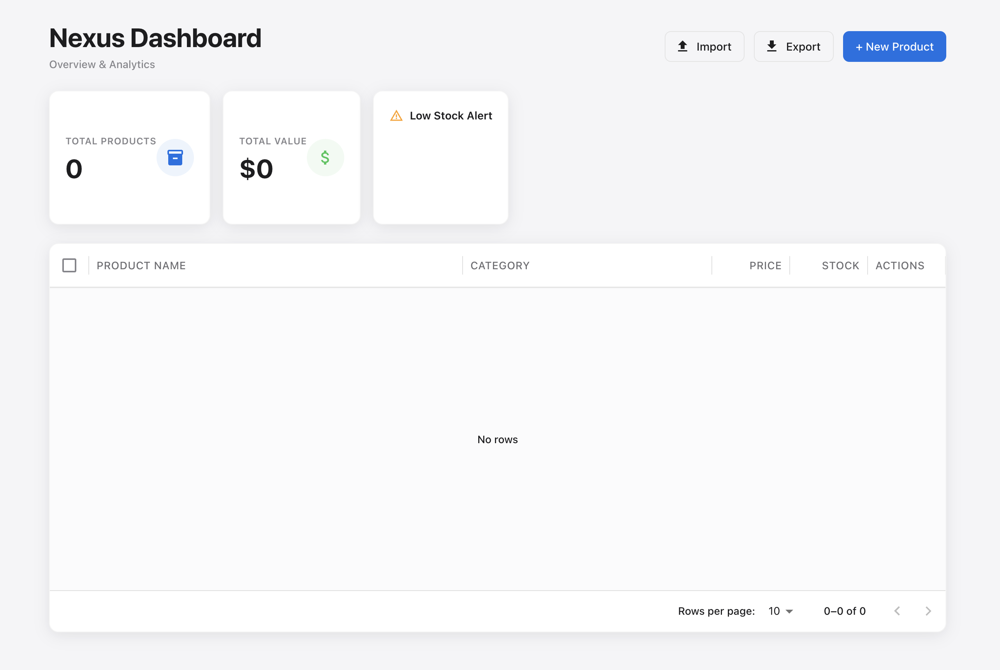

# Nexus - Enterprise Inventory Management System


> A modern, full-stack inventory dashboard featuring Excel data integration and real-time visualization.

**🔴 Live Demo:** [https://inventory-system-liart-iota.vercel.app/](https://inventory-system-liart-iota.vercel.app/)



---

## 📖 Introduction

**Nexus** is an enterprise-grade inventory management system designed to streamline data entry and visualization. Unlike traditional CRUD apps, Nexus features a powerful **Excel Integration Engine**, allowing businesses to migrate legacy data in bulk and export reports with a single click.

Built with the **MERN Stack**, real-time stock analytics, and low-stock alerts to help business owners make informed decisions.
---

## ✨ Key Features

### Core Functionality

* **📊 Interactive Dashboard**
  - Real-time visualization of total inventory value
  - Product distribution tracking using **Recharts**
  - Dynamic statistics cards showing key metrics
  
* **📂 Excel Integration Engine**
  - **Bulk Import**: Parse `.xlsx` files and automatically populate MongoDB
  - **Data Export**: Download complete inventory reports as Excel files
  - Powered by **SheetJS** for reliable file handling
  
* **⚡ Real-Time CRUD Operations**
  - Instant Create, Read, Update, and Delete with live UI updates
  - No page refresh required
  - Optimized API calls for minimal latency
  
* **⚠️ Smart Stock Alerts**
  - Automatically flags low-stock items (< 10 units)
  - Visual indicators in data grid
  - Bar chart visualization for quick identification
  
* **🎨 Modern UI/UX**
  - Designed with **Material UI (MUI)**
  - Responsive design for all screen sizes
  - Clean, professional Apple-inspired aesthetics
  - Smooth animations and transitions

---

## 🛠️ Tech Stack

### Frontend
- **React.js** (v19.2.0) - UI framework
- **Material UI (MUI)** (v7.3.6) - Component library
- **Recharts** (v3.6.0) - Data visualization
- **SheetJS (xlsx)** (v0.18.5) - Excel file processing
- **Axios** (v1.13.2) - HTTP client
- **Vite** (v7.2.4) - Build tool

### Backend
- **Node.js** - Runtime environment
- **Express.js** (v5.2.1) - Web framework
- **MongoDB** - NoSQL database
- **Mongoose** (v9.0.2) - ODM for MongoDB
- **CORS** - Cross-origin resource sharing
- **dotenv** - Environment variable management

### Deployment
- **Frontend**: Vercel
- **Backend**: Render
- **Database**: MongoDB Atlas

---

## 🚀 Getting Started Locally

Follow these steps to run the project on your local machine.

### Prerequisites

Before you begin, ensure you have the following installed:
- **Node.js** (v16 or higher)
- **npm** or **yarn**
- **MongoDB** account (MongoDB Atlas recommended)
- **Git**

### 1. Clone the Repository

```bash
git clone https://github.com/HL42/inventory-system.git
cd inventory-system
```

### 2. Setup Backend

Navigate to the server directory and install dependencies:

```bash
cd server
npm install
```

Create a `.env` file in the `server` folder:

```env
MONGO_URI=your_mongodb_connection_string_here
PORT=5001
```

To get your MongoDB connection string:
1. Sign up for [MongoDB Atlas](https://www.mongodb.com/cloud/atlas)
2. Create a new cluster
3. Click "Connect" → "Connect your application"
4. Copy the connection string and replace `<password>` with your database password

Start the backend server:

```bash
npm run dev
```

You should see:
```
✅ MongoDB Connected Success!
🚀 Server running on port 5001
```

### 3. Setup Frontend

Open a new terminal and navigate to the client directory:

```bash
cd client
npm install
```

Update the API URL if running locally. Open `client/src/App.jsx` and modify line 79:

```javascript
// For local development, use:
const API_BASE_URL = "http://localhost:5001";

// For production deployment, comment out the line above and uncomment:
// const API_BASE_URL = "https://nexus-backend-hchd.onrender.com";
```

**Note**: The current code uses the production URL. Switch to `http://localhost:5001` for local development.

Start the development server:

```bash
npm run dev
```

The application will open at `http://localhost:5173`

---

## 📂 Project Structure

```
inventory-system/
├── client/                 # React Frontend
│   ├── public/            # Static assets
│   ├── src/
│   │   ├── App.jsx        # Main Dashboard Component
│   │   ├── main.jsx       # React entry point
│   │   ├── index.css      # Global styles
│   │   └── assets/        # Images and icons
│   ├── package.json       # Frontend dependencies
│   └── vite.config.js     # Vite configuration
│
├── server/                # Node.js Backend
│   ├── index.js           # Express server & API routes
│   ├── package.json       # Backend dependencies
│   └── .env              # Environment variables (not tracked)
│
└── README.md             # Project documentation
```

---

## 🔌 API Endpoints

### Base URL
- **Production**: `https://nexus-backend-hchd.onrender.com`
- **Local**: `http://localhost:5001`

### Endpoints

#### Get All Products
```http
GET /api/products
```
Returns an array of all products in the database.

**Response Example:**
```json
[
  {
    "_id": "60d5ec49f1b2c72b8c8e4f1a",
    "name": "Laptop",
    "category": "Electronics",
    "price": 1200,
    "stock": 15,
    "lastUpdated": "2024-01-20T10:30:00.000Z"
  }
]
```

#### Create New Product
```http
POST /api/products
Content-Type: application/json
```

**Request Body:**
```json
{
  "name": "Wireless Mouse",
  "category": "Accessories",
  "price": 25,
  "stock": 50
}
```

#### Delete Product
```http
DELETE /api/products/:id
```
Deletes a product by its MongoDB `_id`.

---

## 📊 Product Schema

```javascript
{
  name: String,          // Product name
  category: String,      // Product category
  price: Number,         // Unit price in USD
  stock: Number,         // Available quantity
  lastUpdated: Date      // Timestamp (auto-generated)
}
```

---

## 📝 License

This project is licensed under the **MIT License**. See the [LICENSE](LICENSE) file for details.

---

## 🙏 Acknowledgments

- **Material UI** for the component library
- **Recharts** for beautiful data visualization
- **SheetJS** for Excel file handling
- **MongoDB** for the database solution
- **Vercel** and **Render** for hosting

---

<div align="center">

### ⭐ Star this repository if you find it helpful!

Made with ❤️ by HL42

</div>
